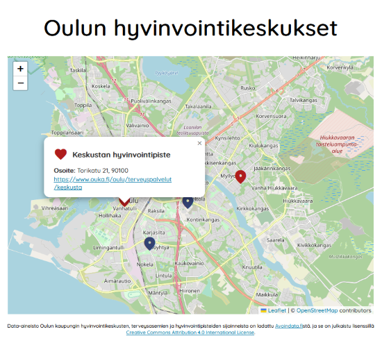

# Leaflet karttasovellus React + Redux

Reactilla ja Leaflet karttakirjastolla toteutettu sovellus, joka näyttää Oulun hyvinvointikeskukset ja niiden yhteystiedot kartalla.

Sovelluksen tarkoitus on ollut soveltaa Redux tilanhallinnan perusteita sekä ymmärtää enemmän karttakoordinaateista ja niiden muuntamisesta.



### Asennus ja käyttöönotto
```
// Install dependencies
npm install

// Run the app in development mode
npm start

// Build the app for production
npm run build
```

### Data
Data-aineisto Oulun kaupungin hyvinvointikeskusten, terveysasemien ja hyvinvointipisteiden sijainnesta on ladattu [Avoindata.fi](https://www.avoindata.fi/data/fi/dataset/hyvinvointikeskusten-terveysasemien-ja-hyvinvointipisteiden-sijainnit1):stä ja se on julkaistu lisenssillä [Creative Commons Attribution 4.0 International License Attribution](https://creativecommons.org/licenses/by/4.0/).